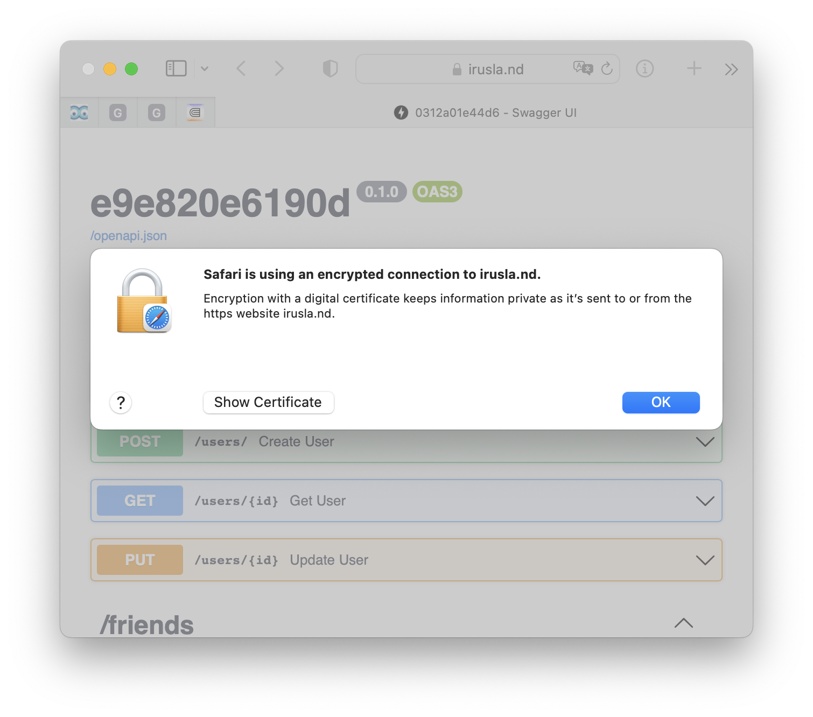
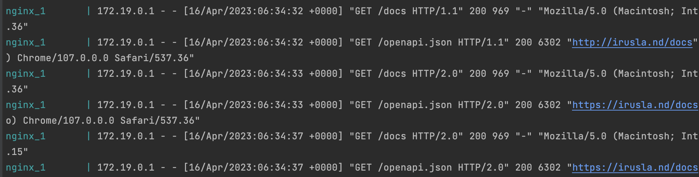

# 1) configuration

uses timeout settings, and backup server
```
upstream api_lb {
    server bacapibara_api_1:8000 max_fails=1 fail_timeout=1;
    server bacapibara_api_2:8000 max_fails=1 fail_timeout=1;
    server bacapibara_api_3:8000 backup;
}
```
HTTPs is also specified
```
listen              443 ssl http2;
server_name         www.irusla.nd;
ssl_certificate     cert.pem;
ssl_certificate_key key.pem;
ssl_protocols       TLSv1 TLSv1.1 TLSv1.2;
ssl_ciphers         HIGH:!aNULL:!MD5;
```

# 2) compose 
simply composed as
```commandline
  nginx:
    image: nginx
    volumes:
      - ./nginx.conf:/etc/nginx/nginx.conf:ro
      - ./certs/cert.pem:/etc/nginx/cert.pem
      - ./certs/key.pem:/etc/nginx/key.pem
    ports:
      - "80:8080"
      - "443:443"
    networks:
      - backend
```

# 3) https, http2, fqdn

https and fqdn was set up



http2.0 is being used by nginx



# 4) host down

config is 

```
server bacapibara_api_1:8000 max_fails=1 fail_timeout=1;
server bacapibara_api_2:8000 max_fails=1 fail_timeout=1;
server bacapibara_api_3:8000 backup;
```

0312a01e44d6, e9e820e6190d - are primary

2b44d572f363 - is backup

check what is up

```
docker ps
CONTAINER ID   IMAGE             COMMAND                  CREATED          STATUS                  PORTS                                                NAMES
e5e45535d21e   nginx             "/docker-entrypoint.…"   12 minutes ago   Up 3 seconds            80/tcp, 0.0.0.0:443->443/tcp, 0.0.0.0:80->8080/tcp   bacapibara_nginx_1
0312a01e44d6   bacapibara_api    "python3 -m uvicorn …"   13 hours ago     Up 8 minutes                                                                 bacapibara_api_1
e9e820e6190d   bacapibara_api    "python3 -m uvicorn …"   13 hours ago     Up 42 minutes                                                                bacapibara_api_2
2b44d572f363   bacapibara_api    "python3 -m uvicorn …"   13 hours ago     Up 12 hours                                                                  bacapibara_api_3
```

page answers with 


let's stop them `docker stop 0312a01e44d6 e9e820e6190d`

```
docker ps
CONTAINER ID   IMAGE             COMMAND                  CREATED          STATUS                  PORTS                                                NAMES
e5e45535d21e   nginx             "/docker-entrypoint.…"   18 minutes ago   Up 5 minutes            80/tcp, 0.0.0.0:443->443/tcp, 0.0.0.0:80->8080/tcp   bacapibara_nginx_1
2b44d572f363   bacapibara_api    "python3 -m uvicorn …"   13 hours ago     Up About a minute                                                            bacapibara_api_3
```

page loads for couple seconds

and we got an answer from backup server


# 5) load test with 100 users 

## without LB


## with LB


|             | no-LB  | LB    |
|-------------|--------|-------|
| RPS         | 260    | 290   |
| latency 50p | 300ms  | 200ms |
| latency 95p | 1000ms | 800ms |

wee see that with LB RPS is pretty much higher and latency without LB is > 1s and with LB < 1s

