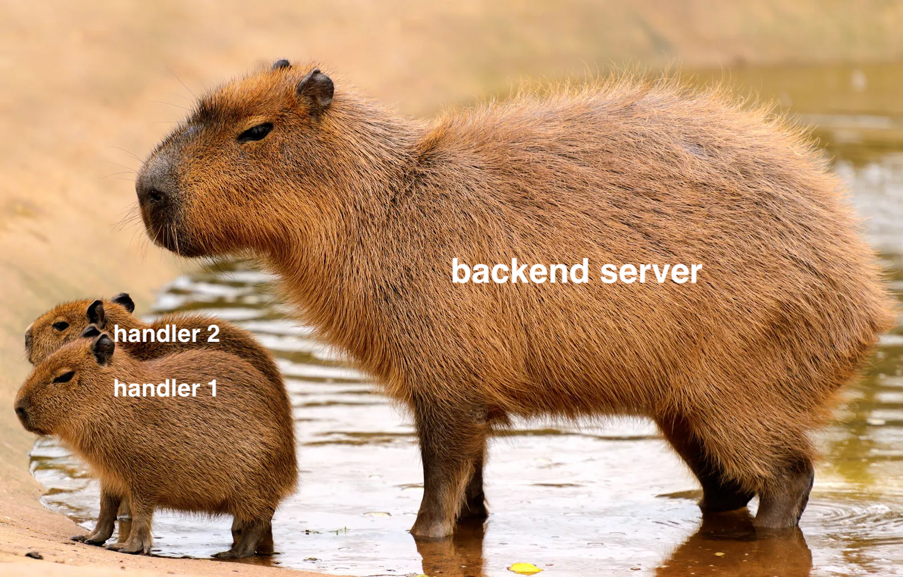
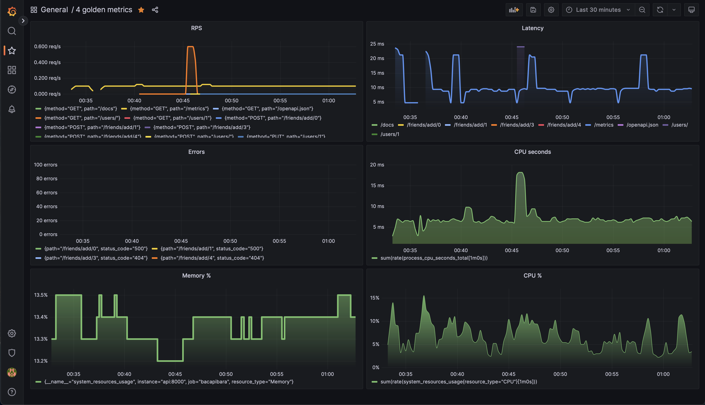
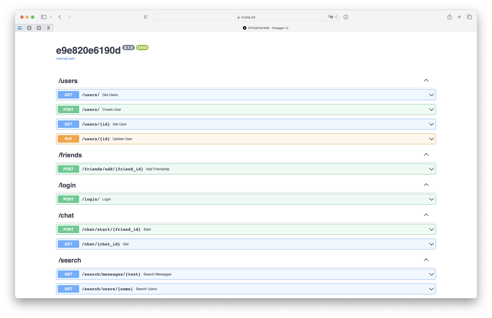

# bacapibara - Backend Academy API



## Requirements

Following packages should be installed 
0. python 3.11 
1. poetry

## Preparation

```shell
make init
source .venv/bin/activate
make install
```

## Usage

Run app

```shell
make run
```

Open swagger http://127.0.0.1:8000/docs

```shell
make swagger
```

## Contribution 

Run linters and tests before commiting changes

```shell
make format
make test
```


## Running in docker

```shell
make docker-build
make docker-up
```

## Running in docker-compose

```shell
minikube start
eval $(minikube docker-env)
make kube-run
```

To access the pod, forward the ports

```shell
kubectl port-forward bacapibara-api 8000
```

and checkout http://127.0.0.1:8000/docs#/


## Migrations

create migration
```commandline
alembic revision --autogenerate -m "message"
```

run migrations
```commandline
make upgrade
```

rollback single migration
```commandline
make downgrade
```


## Grafana



## Load balancing with NGINX




## Queue messaging

lets start the app with multiple consumers at the same time! 


make 2 separate accounts

then send an announcement from user 1 to friends


we see rps goes up

in each consumer we see `b'{"announcement": {"statement": {"content": "\\u041f\\u0440\\u0438\\u0432\\u0435\\u0442!"}, "by": 0, "at": "2023-05-23T02:01:10.862164"}, "to": 1}'`

take a look at user 2 announcements, here they are!


lets spam for a bit. works great


database also stores the messages


actually both users see the messages


## Credits 

[Ruslan Sirazhetdinov - @irusland](https://github.com/irusland)
