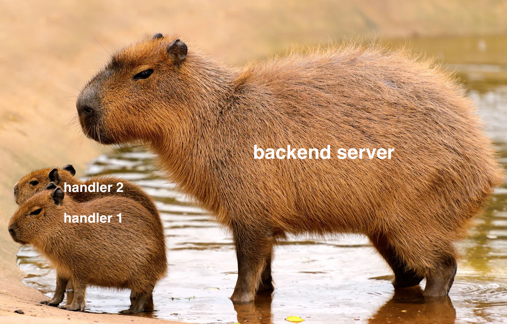
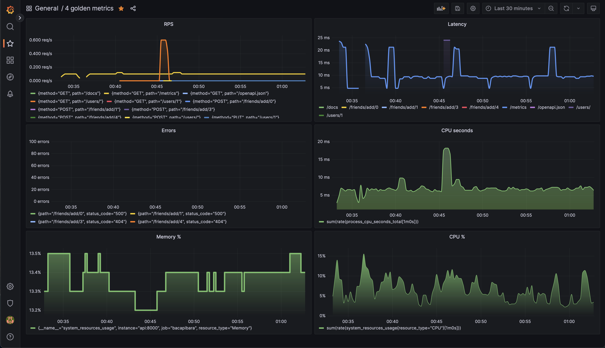

# bacapibara - Backend Academy API



## Requirements

Following packages should be installed 
0. python 3.11 
1. poetry

## Preparation

```shell
make init
source .venv/bin/activate
make install
```

## Usage

Run app

```shell
make run
```

Open swagger http://127.0.0.1:8000/docs

```shell
make swagger
```

## Contribution 

Run linters and tests before commiting changes

```shell
make format
make test
```


## Running in docker

```shell
make docker-build
make docker-up
```

## Running in docker-compose

```shell
minikube start
eval $(minikube docker-env)
make kube-run
```

To access the pod, forward the ports

```shell
kubectl port-forward bacapibara-api 8000
```

and checkout http://127.0.0.1:8000/docs#/


## Migrations

create migration
```commandline
alembic revision --autogenerate -m "message"
```

run migrations
```commandline
make upgrade
```

rollback single migration
```commandline
make downgrade
```


## Grafana



## Credits 

[Ruslan Sirazhetdinov - @irusland](https://github.com/irusland)
